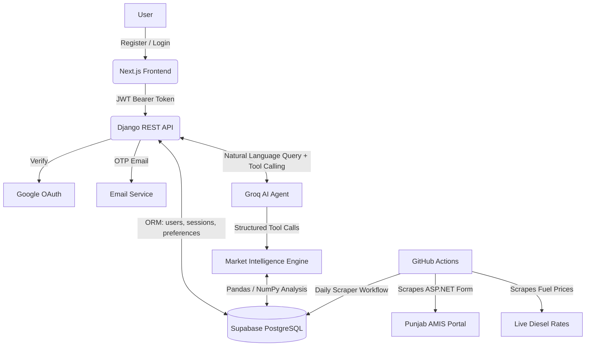

# 🌾 AMIS: Mandi Market Intelligence

<div align="center">


**Twenty years of Punjab's Agriculture Marketing Information Service (AMIS) data, finally usable.**

AMIS Mandi Market Intelligence turns a legacy government price database into a live, AI-powered platform. It brings together historical trend charts, logistics-aware arbitrage detection, anomaly alerts, and a bilingual natural-language agent, built for farmers, traders, and commission agents across Punjab.

[**Live App**](https://aims-orcin.vercel.app/) · [**API Docs**](https://aims-wpuy.onrender.com/api/) · [**Demo Video**](https://www.loom.com/share/67034ff494a84efdb571c5843cc8cdde)

</div>

---

## 📋 Table of Contents

- [Who This Is For](#-who-this-is-for)
- [Live Environments](#-live-environments)
- [Platform Interface](#-platform-interface)
- [Core Features](#-core-features)
- [Tech Stack](#️-tech-stack)
- [System Workflow](#️-system-workflow)
- [Architecture](#-architecture)
- [Repository Structure](#-repository-structure)
- [Getting Started](#-getting-started)
- [API Reference](#-api-reference)
- [Environment Variables](#-environment-variables)
- [Roadmap](#-roadmap)
- [Credits](#-credits)
- [License](#-license)

---

## 🎯 Who This Is For

AMIS is designed around three real users, not generic "market data consumers."

| Persona | Goal | What They Use |
| :--- | :--- | :--- |
| 🧑‍🌾 **The Farmer (Kissan)** | *"Am I being scammed by the middleman?"* | Asks the AI chat in Urdu or English, like *"tamatar ka rate Lahore mein kya hai?"*, to confirm a fair price before selling |
| 🚛 **The Transporter / Trader** | *"Where can I make the most profit today?"* | Opens the Arbitrage Dashboard for ranked buy/sell routes with real net profit after fuel cost |
| 📦 **The Commission Agent (Arthi)** | *"What's the macro trend?"* | Uses the Commodity Deep-Dive charts and AI Advisory badge to decide whether to hoard or sell stock |

---

## 🌐 Live Environments

- **Web Application:** [aims-orcin.vercel.app](https://aims-orcin.vercel.app/)
- **Backend API:** [aims-wpuy.onrender.com/api](https://aims-wpuy.onrender.com/api/)
- **Interactive API Docs (Swagger):** available at `/api/` on the backend URL above
- **Demo Video:** [Watch on Loom](https://www.loom.com/share/67034ff494a84efdb571c5843cc8cdde)

---

## 📸 Platform Interface

| Settings & Preferences | AI Tool-Calling Agent |
| :---: | :---: |
|  |  |
| **Commodity Deep-Dive** | **Live Arbitrage Dashboard** |
|  |  |

---

## ✨ Core Features

### Data & Intelligence
- **📊 Automated Data Pipeline.** Daily scraping of AMIS mandi prices and live diesel/fuel rates via scheduled GitHub Actions, normalized into clean time-series records in PostgreSQL.
- **📈 Trend & Anomaly Detection.** Rising/falling/stable direction, percentage change, and Z-score-based anomaly flagging against 30-day historical baselines.
- **🚛 Logistics-Aware Arbitrage.** Cross-city price gap detection with true net profit, computed using real inter-city distance and live diesel prices, not just raw margin.
- **🧭 AI Advisory Engine.** Rule-based buy/sell/hold recommendations combining trend and anomaly signals, with human-readable reasoning.

### Conversational AI
- **🧠 Bilingual Tool-Calling Agent.** Groq-powered chat that understands English, Urdu, Roman Urdu, and Punjabi, translating natural questions (like *"pyaz ka bhao Sahiwal mein kitna hai?"*) into structured tool calls against live data.
- **💬 Persistent Chat Sessions.** Conversations are saved per user with full history and a session sidebar, not just a stateless single-turn chatbot.

### Accounts & Security
- **🔐 Full Authentication System.** Email/password registration with OTP email verification, Google OAuth sign-in, JWT access/refresh tokens with rotation and blacklisting, and forgot/reset/change-password flows.
- **⚙️ User Preferences.** Saved home city, preferred commodities, and a watchlist, used to personalize dashboard defaults and feed real inter-city distance into arbitrage calculations.

### Interface
- **📱 Four Purpose-Built Screens.** AI Chat, Arbitrage Dashboard, Commodity Deep-Dive (with Advisory Badge), and Settings, each mapped directly to one of the three personas above.
- **🌗 Dark/Light Theming.** Full theme support with a custom agriculture-inspired design system (deep green and amber palette), smooth motion via Framer Motion.
- **📄 Auto-Generated API Docs.** Every backend endpoint documented and testable via Swagger UI, generated directly from serializers.

---

## 🛠️ Tech Stack

| Layer | Technology | Purpose |
| :--- | :--- | :--- |
| **Frontend** | Next.js 14 (App Router), TypeScript, Tailwind CSS, shadcn/ui | Interactive, themeable web dashboard |
| **Frontend State** | Zustand, TanStack Query | Auth state and server-state caching/refetching |
| **Frontend Motion** | Framer Motion, Recharts | Animation and price trend visualization |
| **Backend API** | Django REST Framework | Secure REST endpoints, request validation, API orchestration |
| **Auth** | djangorestframework-simplejwt, Google Auth | JWT access/refresh tokens, Google OAuth verification |
| **Database** | PostgreSQL (Supabase) | Time-series price storage and relational user data |
| **AI / LLM** | Groq  | Low-latency structured tool-calling for natural language queries |
| **Data Engine** | Pandas, NumPy | Trend calculation, Z-score anomaly detection, arbitrage math |
| **Scraper** | Requests, BeautifulSoup | Extracting data from the legacy ASP.NET AMIS portal |
| **API Docs** | drf-spectacular | Auto-generated OpenAPI schema and Swagger UI |
| **Automation** | GitHub Actions | Scheduled daily scraping workflow |
| **Hosting** | Vercel (frontend), Render (backend), Supabase (database) | Production deployment |

---

## ⚙️ System Workflow

1. **Data Ingestion.** A scheduled GitHub Actions workflow scrapes min/max/FQP prices from the AMIS ASP.NET portal and live diesel prices, writing both into Supabase PostgreSQL.
2. **Authentication.** A user registers or signs in via email/OTP or Google. The backend issues a short-lived JWT access token and a rotating refresh token.
3. **Data Processing.** Pandas computes moving trends and Z-score anomalies on request. Arbitrage calculations combine price spread with real distance and live fuel cost for a true net margin.
4. **User Query.** The user asks a question in the chat (English, Urdu, Roman Urdu, or Punjabi) or interacts with the Arbitrage/Commodity dashboards directly.
5. **Agentic Routing.** For chat, the Groq-powered agent parses intent, selects the correct tool (`get_trend`, `get_anomaly`, `get_arbitrage`, `get_advisory`), executes it against live data, and replies in the same language the user used.
6. **Insights Delivery.** The backend returns structured JSON. The frontend renders it as charts, ranked route cards, or an advisory badge, and persists the exchange in the user's chat history.

---

## 🏗️ Architecture



---

## 📁 Repository Structure

```
mandi-edge/
├── backend/                    # Django REST Framework API
│   ├── apps/
│   │   ├── accounts/            # JWT auth, OTP, Google login, password reset
│   │   ├── profiles/            # User preferences (home city, watchlist)
│   │   ├── market_data/         # Trend, anomaly, arbitrage, advisory endpoints
│   │   └── agent/                # Groq chat agent with persisted sessions
│   ├── config/                  # Settings, URLs, WSGI/ASGI
│   └── vendor/mandiedge/        # Data intelligence engine (scraper + intelligence.py)
│
├── frontend/                    # Next.js dashboard
│   └── src/
│       ├── app/                  # Auth screens and 4 dashboard screens
│       ├── components/           # Chat, arbitrage, commodity, settings UI
│       ├── hooks/                 # TanStack Query hooks per feature
│       └── lib/                   # API client, auth storage, geo utilities
│
├── docs/                        # Project proposal, roadmap, schema, and agent docs
│
├── package.json
└── package-lock.json
```

---

## 🚀 Getting Started

### Prerequisites
- Python 3.11+
- Node.js 18+
- A Supabase project (PostgreSQL and credentials)
- A Groq API key
- A Google OAuth Client ID (for Google sign-in)

### 1. Clone the repository

```bash
git clone https://github.com/s-zaid-13/aims-mandi-market-intelligence.git
cd mandi-edge
```

### 2. Backend setup

```bash
cd backend
python -m venv venv
source venv/bin/activate        # Windows: venv\Scripts\activate

pip install -r requirements.txt
cp .env.example .env            # fill in credentials, see Environment Variables below

python manage.py migrate
python manage.py runserver
```

Backend runs at `http://localhost:8000`. Swagger docs are at `http://localhost:8000/api/`.

### 3. Frontend setup

```bash
cd ../frontend
npm install
cp .env.local.example .env.local   # fill in credentials

npm run dev
```

Frontend runs at `http://localhost:3000`.

---

## 📡 API Reference

Full interactive documentation is auto-generated and available at `/api/` (Swagger UI). Key endpoint groups:

| Group | Base Path | Description |
| :--- | :--- | :--- |
| Auth | `/api/auth/` | Register, verify email, login, Google login, refresh, logout, password reset |
| Preferences | `/api/me/preferences/` | Get/update home city, commodities, watchlist |
| Market Data | `/api/trend/`, `/api/anomaly/`, `/api/arbitrage/`, `/api/advisory/` | Core intelligence endpoints |
| Reference Data | `/api/commodities/`, `/api/cities/` | Dynamic lists sourced live from the database |
| Chat | `/api/chat/`, `/api/chat/sessions/` | AI agent messaging and session history |

All endpoints except registration and login require an `Authorization: Bearer <access_token>` header.

---

## 🔑 Environment Variables

**Backend (`.env`)**

```env
DJANGO_SECRET_KEY=
DEBUG=True
ALLOWED_HOSTS=localhost,127.0.0.1
CORS_ALLOWED_ORIGINS=http://localhost:3000

DATABASE_URL=              # Supabase Postgres connection pooler URI
SUPABASE_URL=               # Used by the intelligence engine
SUPABASE_KEY=

EMAIL_HOST=smtp.gmail.com
EMAIL_PORT=587
EMAIL_HOST_USER=your_email_host_user_here
EMAIL_HOST_PASSWORD=your_email_host_password_here
DEFAULT_FROM_EMAIL=your_default_from_email_here

GROQ_API_KEY=
GROQ_MODEL=qwen/qwen3.6-27b
USE_LIVE_MARKET_DATA=True

GOOGLE_OAUTH_CLIENT_ID=
FRONTEND_RESET_PASSWORD_URL=http://localhost:3000/reset-password
```

**Frontend (`.env.local`)**

```env
NEXT_PUBLIC_API_BASE_URL=http://127.0.0.1:8000/api
NEXT_PUBLIC_GOOGLE_CLIENT_ID=
```

---

## 🗺️ Roadmap

- [ ] Voice input for the AI chat (Urdu/English speech-to-text)
- [ ] Persistent AI memory across sessions for deeper personalization
- [ ] Push notifications for price alerts on watchlisted commodities
- [ ] Expanded commodity and city coverage as scraper data grows

---

## 👤 Credits

- **Arslan Babar**, [@Arslan-Codes097](https://github.com/Arslan-Codes097)
- **Samama Zaid**, [@s-zaid-13](https://github.com/s-zaid-13)

---

## © License

Proprietary Software. © 2026 AMIS Mandi Market Intelligence. All Rights Reserved.

This repository is publicly visible for portfolio and demonstration purposes only. Visibility does not grant any license to use, copy, modify, or distribute this software. All rights are reserved by the authors, and any reuse requires prior written permission.