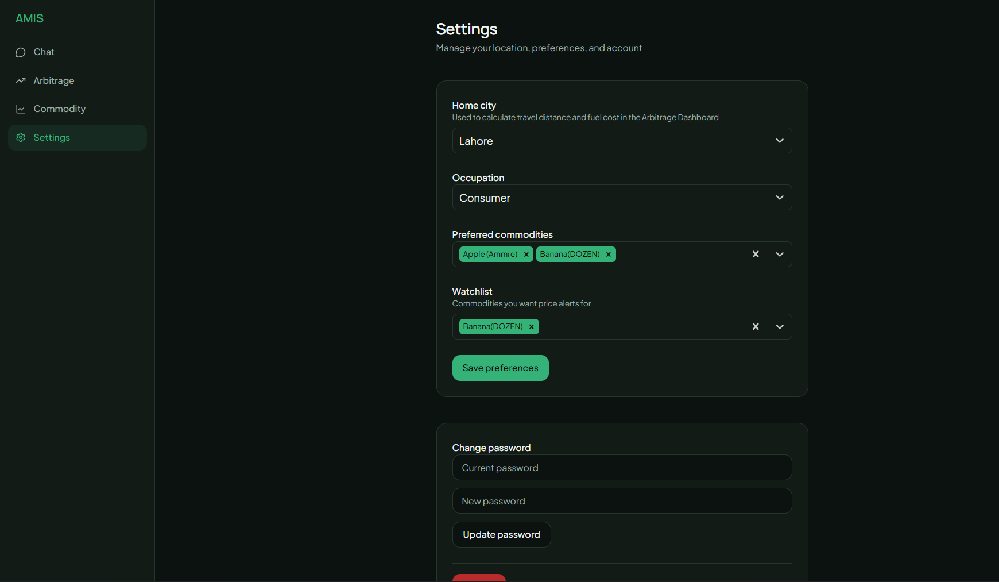
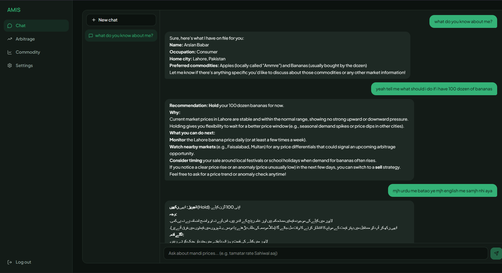
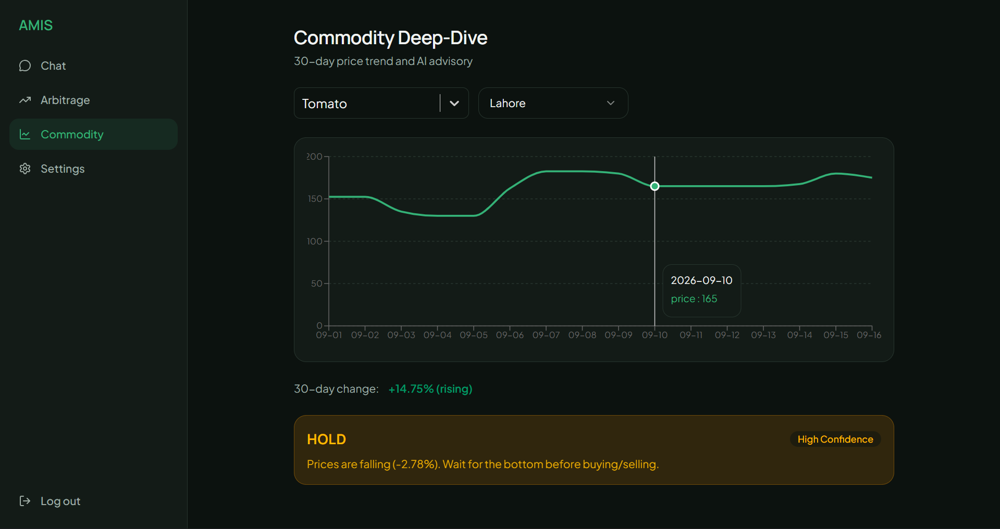
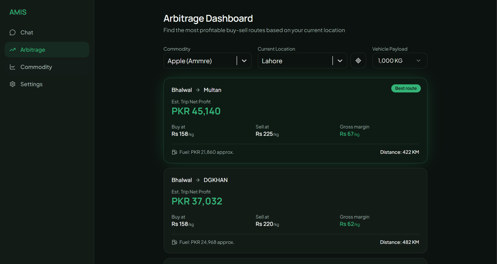
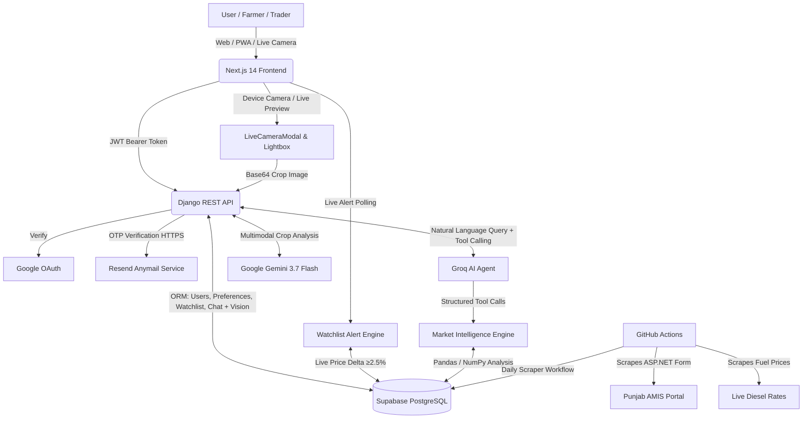

# 🌾 AMIS: Mandi Market Intelligence

<div align="center">


**Twenty years of Punjab's Agriculture Marketing Information Service (AMIS) data, finally usable.**

AMIS Mandi Market Intelligence turns a legacy government price database into a live, AI-powered platform. It brings together historical trend charts, logistics-aware arbitrage detection, anomaly alerts, and a bilingual natural-language agent, built for farmers, traders, and commission agents across Punjab.

[**Live App**](https://amis-market-intelligence.me/) · [**API Docs**](https://aims-wpuy.onrender.com/api/) · [**Demo Video**](https://www.loom.com/share/67034ff494a84efdb571c5843cc8cdde)

</div>

---

## 📋 Table of Contents

- [Who This Is For](#-who-this-is-for)
- [Live Environments](#-live-environments)
- [Platform Interface](#-platform-interface)
- [Core Features](#-core-features)
- [Tech Stack](#️-tech-stack)
- [System Workflow](#️-system-workflow)
- [Architecture](#-architecture)
- [Repository Structure](#-repository-structure)
- [Getting Started](#-getting-started)
- [API Reference](#-api-reference)
- [Environment Variables](#-environment-variables)
- [Roadmap](#-roadmap)
- [Credits](#-credits)
- [License](#-license)

---

## 🎯 Who This Is For

AMIS is designed around three real users, not generic "market data consumers."

| Persona | Goal | What They Use |
| :--- | :--- | :--- |
| 🧑‍🌾 **The Farmer (Kissan)** | *"Am I being scammed by the middleman?"* | Asks the AI chat in Urdu or English, like *"tamatar ka rate Lahore mein kya hai?"*, to confirm a fair price before selling |
| 🚛 **The Transporter / Trader** | *"Where can I make the most profit today?"* | Opens the Arbitrage Dashboard for ranked buy/sell routes with real net profit after fuel cost |
| 📦 **The Commission Agent (Arthi)** | *"What's the macro trend?"* | Uses the Commodity Deep-Dive charts and AI Advisory badge to decide whether to hoard or sell stock |

---

## 🌐 Live Environments

- **Web Application (Custom Domain):** [amis-market-intelligence.me](https://amis-market-intelligence.me/) *(Vercel Backup: [aims-orcin.vercel.app](https://aims-orcin.vercel.app/))*
- **Backend API Server:** [api.amis-market-intelligence.me/api](https://api.amis-market-intelligence.me/api/) *(Render Live API: [aims-wpuy.onrender.com/api](https://aims-wpuy.onrender.com/api/))*
- **Interactive API Docs (Swagger):** available at `/api/` on the backend URL above
- **Demo Video:** [Watch on Loom](https://www.loom.com/share/67034ff494a84efdb571c5843cc8cdde)

---

## 📸 Platform Interface

| Settings & Preferences | AI Tool-Calling Agent |
| :---: | :---: |
|  |  |
| **Commodity Deep-Dive** | **Live Arbitrage Dashboard** |
|  |  |

---

## ✨ Core Features

#### Data & Intelligence
- **📅 Automated Data Pipeline.** Daily scraping of AMIS mandi prices and live diesel/fuel rates via scheduled GitHub Actions, normalized into clean time-series records in PostgreSQL.
- **📈 Trend & Anomaly Detection.** Rising/falling/stable direction, percentage change, and Z-score-based anomaly flagging against 30-day historical baselines.
- **🚛 Logistics-Aware Arbitrage.** Cross-city price gap detection with true net profit, computed using real inter-city distance and live diesel prices, not just raw margin.
- **🧠 AI Advisory Engine.** Rule-based buy/sell/hold recommendations combining trend and anomaly signals, with human-readable reasoning.
- **🔔 Real-Time Watchlist Price Alerts.** Live calculation engine scanning watchlisted commodities for significant moves (≥2.5% spike/dip), surfaced through a top `MandiDigestBanner` and header notification bell.

### Conversational AI & Multimodal Vision
- **👁️ Multimodal Crop Quality Grading (Gemini Vision).** Integrated directly into the AI Chat. Farmers can snap or upload harvest photos (e.g. tomatoes, onions) to receive instant quality grading (**Grade A, Grade B, or Grade C**), disease/defect detection (blight, rot, bruising), and contextual pricing advice powered by Google's `gemini-3.7-flash`.
- **📸 Live Laptop Webcam & Mobile Viewfinder.** In-browser live camera capture modal (`LiveCameraModal`) with real-time video preview, shutter controls, and device gallery upload via a sleek unified `+` button.
- **💬 Bilingual Tool-Calling Agent.** Groq-powered chat that understands English, Urdu, Roman Urdu, and Punjabi, translating natural questions (like *"pyaz ka bhao Sahiwal mein kitna hai?"*) into structured tool calls against live data.
- **💾 Persistent Multimodal History.** Chat conversations and uploaded crop pictures are saved per user in PostgreSQL with full message history, lightbox image zoom, and glowing quality grade badges.

### Accounts & Security
- **🔐 Full Authentication System.** Email/password registration with OTP email verification (via Resend HTTP API), Google OAuth sign-in, JWT access/refresh tokens with rotation and blacklisting, and forgot/reset/change-password flows.
- **⚙️ User Preferences.** Saved home city, preferred commodities, and a watchlist, used to personalize dashboard defaults, alerts, and inter-city distances.

### Interface & PWA
- **📱 Progressive Web App (PWA) & Web Push.** Native installability on mobile and desktop, offline manifest caching, and lock-screen Web Push notification alerts for major price moves.
- **🛎️ Sticky Header & Notification Bell.** Real-time unread alert counter with an interactive dropdown for previewing price swings and jumping directly to live commodity charts.
- **🎨 Dark/Light Theming.** Full theme support with a custom agriculture-inspired design system (deep green and amber palette), smooth motion via Framer Motion.
- **📡 Auto-Generated API Docs.** Every backend endpoint documented and testable via Swagger UI, generated directly from serializers.

---

## 🛠️ Tech Stack

| Layer | Technology | Purpose |
| :--- | :--- | :--- |
| **Frontend** | Next.js 14 (App Router), TypeScript, Tailwind CSS, shadcn/ui | Interactive, themeable web dashboard & PWA |
| **Frontend State** | Zustand, TanStack Query | Auth state and server-state caching/refetching |
| **Frontend Motion** | Framer Motion, Recharts | Animation and price trend visualization |
| **Backend API** | Django REST Framework | Secure REST endpoints, request validation, API orchestration |
| **Auth** | djangorestframework-simplejwt, Google Auth | JWT access/refresh tokens, Google OAuth verification |
| **Database** | PostgreSQL (Supabase) | Time-series price storage, relational user data, and multimodal chat history |
| **Vision AI / Multimodal** | Google GenAI (`gemini-3.7-flash`, `3.6-flash`) | Automated crop quality grading, defect detection, and multimodal reasoning |
| **Agent / NL Parsing** | Groq | Low-latency structured tool-calling for natural language market queries |
| **Email Delivery** | django-anymail, Resend | Transactional OTP emails and account verification over HTTPS |
| **Data Engine** | Pandas, NumPy | Trend calculation, Z-score anomaly detection, arbitrage math |
| **Scraper** | Requests, BeautifulSoup | Extracting data from the legacy ASP.NET AMIS portal |
| **API Docs** | drf-spectacular | Auto-generated OpenAPI schema and Swagger UI |
| **Automation** | GitHub Actions | Scheduled daily scraping workflow |
| **Hosting & Custom Domain** | Namecheap (DNS), Vercel (frontend), Render (backend), Supabase (database) | Production custom domain (`amis-market-intelligence.me`) and serverless deployment |

---

## ⚙️ System Workflow

1. **Data Ingestion.** A scheduled GitHub Actions workflow scrapes min/max/FQP prices from the AMIS ASP.NET portal and live diesel prices, writing both into Supabase PostgreSQL.
2. **Authentication.** A user registers or signs in via email/OTP or Google. The backend issues a short-lived JWT access token and a rotating refresh token.
3. **Data Processing.** Pandas computes moving trends and Z-score anomalies on request. Arbitrage calculations combine price spread with real distance and live fuel cost for a true net margin.
4. **User Query.** The user asks a question in the chat (English, Urdu, Roman Urdu, or Punjabi) or interacts with the Arbitrage/Commodity dashboards directly.
5. **Agentic Routing.** For chat, the Groq-powered agent parses intent, selects the correct tool (`get_trend`, `get_anomaly`, `get_arbitrage`, `get_advisory`), executes it against live data, and replies in the same language the user used.
6. **Insights Delivery.** The backend returns structured JSON. The frontend renders it as charts, ranked route cards, or an advisory badge, and persists the exchange in the user's chat history.

---

## 🏗️ Architecture



---

## 📁 Repository Structure

```
mandi-edge/
├── backend/                    # Django REST Framework API
│   ├── apps/
│   │   ├── accounts/            # JWT auth, OTP verification (Resend), Google OAuth, password reset
│   │   ├── profiles/            # User preferences & Watchlist Alerts Engine (/api/me/alerts/)
│   │   ├── market_data/         # Trend, anomaly, arbitrage, advisory endpoints
│   │   └── agent/                # Groq tool-calling agent + Gemini Multimodal Vision crop grader
│   ├── config/                  # Settings, URLs, Anymail config, WSGI/ASGI
│   └── vendor/mandiedge/        # Data intelligence engine (scraper + intelligence.py)
│
├── frontend/                    # Next.js 14 dashboard & PWA
│   └── src/
│       ├── app/                  # Auth screens and 4 dashboard screens (Overview, Analysis, Arbitrage, Chat)
│       ├── components/           # Chat, arbitrage, commodity, settings UI
│       │   ├── layout/           # Notification bell, MandiDigestBanner, header, sidebar
│       │   └── vision/           # LiveCameraModal, CropGradeBadge, ImageLightbox
│       ├── hooks/                 # TanStack Query hooks (useWatchlistAlerts, useAuth, useChat, etc.)
│       └── lib/                   # API client, auth storage, geo utilities
│
├── docs/                        # Project proposal, roadmap, schema, and agent docs
│
├── package.json
└── package-lock.json
```

---

## 🚀 Getting Started

### Prerequisites
- Python 3.11+
- Node.js 18+
- A Supabase project (PostgreSQL and credentials)
- A Groq API key (for low-latency natural language tool calling)
- A Google Gemini API key (for crop quality grading via `gemini-3.7-flash`)
- A Resend API key (for transactional OTP email verification via `django-anymail`)
- A Google OAuth Client ID (for Google sign-in)

### 1. Clone the repository

```bash
git clone https://github.com/s-zaid-13/aims-mandi-market-intelligence.git
cd mandi-edge
```

### 2. Backend setup

```bash
cd backend
python -m venv venv
source venv/bin/activate        # Windows: venv\Scripts\activate

pip install -r requirements.txt
cp .env.example .env            # fill in credentials, see Environment Variables below

python manage.py migrate
python manage.py runserver
```

Backend runs at `http://localhost:8000`. Swagger docs are at `http://localhost:8000/api/`.

### 3. Frontend setup

```bash
cd ../frontend
npm install
cp .env.local.example .env.local   # fill in credentials

npm run dev
```

Frontend runs at `http://localhost:3000`.

---

## 📡 API Reference

Full interactive documentation is auto-generated and available at `/api/` (Swagger UI). Key endpoint groups:

| Group | Base Path | Description |
| :--- | :--- | :--- |
| Auth | `/api/auth/` | Register, verify email OTP, login, Google login, refresh, logout, password reset |
| Preferences | `/api/me/preferences/` | Get/update home city, commodities, watchlist |
| Alerts | `/api/me/alerts/` | Real-time price spike and dip alerts (≥2.5%) for watchlisted commodities in home city |
| Market Data | `/api/trend/`, `/api/anomaly/`, `/api/arbitrage/`, `/api/advisory/` | Core intelligence endpoints (Pandas/NumPy) |
| Reference Data | `/api/commodities/`, `/api/cities/` | Dynamic lists sourced live from the database |
| Chat & Vision | `/api/chat/`, `/api/chat/sessions/` | AI agent messaging, persistent sessions, and multimodal crop grading (base64 image upload) |

All endpoints except registration and login require an `Authorization: Bearer <access_token>` header.

---

## 🔑 Environment Variables

**Backend (`.env`)**

```env
DJANGO_SECRET_KEY=
DEBUG=True
ALLOWED_HOSTS=localhost,127.0.0.1
CORS_ALLOWED_ORIGINS=http://localhost:3000

DATABASE_URL=              # Supabase Postgres connection pooler URI
SUPABASE_URL=               # Used by the intelligence engine
SUPABASE_KEY=

# Email Delivery (Resend via django-anymail over HTTPS)
RESEND_API_KEY=
DEFAULT_FROM_EMAIL=AMIS Market Intelligence <onboarding@resend.dev>

# AI LLM & Multimodal Vision
GROQ_API_KEY=
GROQ_MODEL=qwen/qwen3.6-27b
GEMINI_API_KEY=
GEMINI_VISION_MODEL=gemini-3.7-flash
USE_LIVE_MARKET_DATA=True

GOOGLE_OAUTH_CLIENT_ID=
FRONTEND_RESET_PASSWORD_URL=http://localhost:3000/reset-password
```

**Frontend (`.env.local`)**

```env
NEXT_PUBLIC_API_BASE_URL=http://127.0.0.1:8000/api
NEXT_PUBLIC_GOOGLE_CLIENT_ID=
```

---

## 🗺️ Roadmap

- [x] Multimodal computer vision crop grading & disease detection (Google Gemini 3.7 Flash)
- [x] In-browser live laptop webcam capture & device camera viewfinder
- [x] Real-time Watchlist price spike/dip alerts engine (`/api/me/alerts/`)
- [x] Interactive Notification Bell & dismissible `MandiDigestBanner`
- [x] PWA offline caching & Web Push notification integration
- [ ] Voice input for the AI chat (Urdu/English speech-to-text)
- [ ] Persistent AI memory across sessions for personalized mandi trading journals
- [ ] Multi-province mandi expansion (Sindh, KP, Balochistan) as scraper coverage grows

---

## 👤 Credits

- **Arslan Babar**, [@Arslan-Codes097](https://github.com/Arslan-Codes097)
- **Samama Zaid**, [@s-zaid-13](https://github.com/s-zaid-13)

---

## © License

Proprietary Software. © 2026 AMIS Mandi Market Intelligence. All Rights Reserved.

This repository is publicly visible for portfolio and demonstration purposes only. Visibility does not grant any license to use, copy, modify, or distribute this software. All rights are reserved by the authors, and any reuse requires prior written permission.