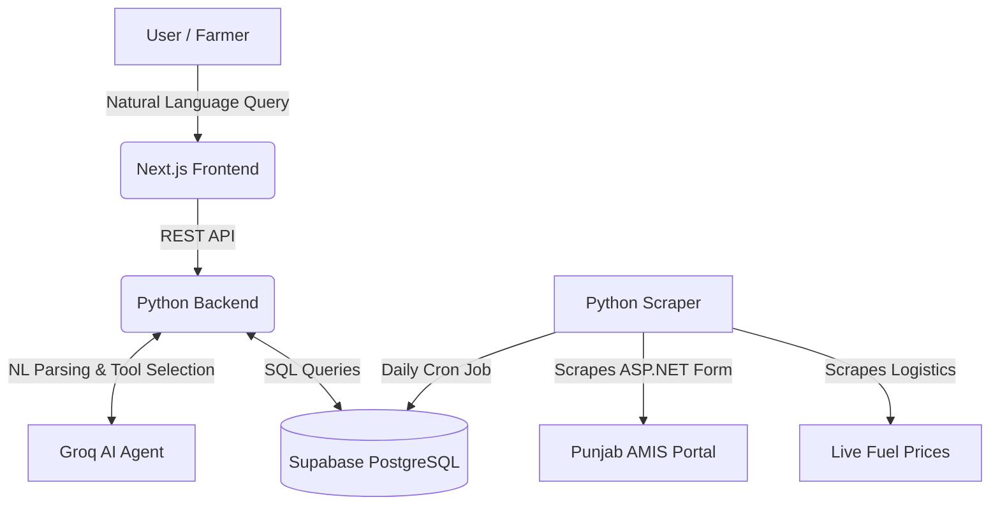

# 🎬 AMIS Mandi Market Intelligence

**AMIS Mandi Market Intelligence** unlocks 20 years of Punjab's Agriculture Marketing Information Service (AMIS) data. It transforms a legacy government database into an intelligent, AI-powered platform featuring historical charting, live logistics-aware arbitrage detection, and a natural language tool-calling agent designed for farmers, traders, and researchers.

---

## 🌐 Live Product Environments

- **Web Application:** [https://aims-orcin.vercel.app/](https://aims-orcin.vercel.app/)
- **Backend API Server:** [https://aims-wpuy.onrender.com/api/](https://aims-wpuy.onrender.com/api/)
- **Demo Video:** *Placeholder for demo video (docs/assets/demo.mp4)*

---

## 📸 Platform Interface

| Settings Configuration | AI Tool-Calling Agent |
| :---: | :---: |
|  |  |
| **Commodity Analysis** | **Live Arbitrage Margins** |
|  |  |

---

## ✨ Core Product Features

- **📊 Historical Data Pipeline:** Automated daily scraping of AMIS and fuel prices, normalizing unstructured legacy data into clean time-series metrics.
- **🧠 AI Tool-Calling Agent:** Chat interface powered by Groq that translates natural human language (e.g., *"tamatar rate Sahiwal aaj"*) into structured database queries.
- **📈 Trend & Anomaly Detection:** Compute real insights including rising/falling directions, volatility scores, and unexpected price shocks.
- **🚛 Logistics-Aware Arbitrage:** Cross-city price gap detection with true Net Margins calculated using real-world diesel travel costs.
- **🔐 Persistent User Memory:** Saves preferred cities and commodities per user via Supabase Auth for contextual query understanding.

---

## 🛠️ Enterprise Tech Stack

| Category | Technology | Purpose |
| :--- | :--- | :--- |
| **Frontend** | Next.js, Tailwind, Recharts | Interactive web dashboard and data visualization |
| **Backend API** | FastAPI / Django (Python) | Async endpoints, backend architecture |
| **Database** | PostgreSQL (Supabase) | Time-series storage, Auth, and Row Level Security |
| **AI / LLM** | Groq (Llama / GPT-OSS) | Fast structured JSON output for NL tool-calling |
| **Data Engine** | Pandas, Numpy, Scipy | Trend, statistical analysis, and ML logic |
| **Scraper** | BeautifulSoup, Requests | Handling legacy ASP.NET postback forms |

---

## ⚙️ System Workflow

1. **Data Ingestion:** A scheduled Cron job scrapes daily min/max/FQP prices from the AMIS ASP.NET portal and live diesel prices, writing them to a Supabase PostgreSQL database.
2. **Data Processing:** Pandas and SciPy scripts calculate moving averages, historical anomalies, and true arbitrage margins based on geographical distances and fuel costs.
3. **User Query:** A user types a natural language question into the Next.js dashboard.
4. **Agentic Routing:** The Groq-powered AI agent parses the intent, selects the appropriate backend tool (e.g., `get_trend`, `get_arbitrage`), and executes the structured query.
5. **Insights Delivery:** The backend executes the logic and the frontend renders the response alongside interactive charts.

---

## 🏗️ Cloud Architecture

---

## © Copyright & License

**Proprietary Software**  
© 2026 AMIS Mandi Market Intelligence. All Rights Reserved.  
*This software is the confidential and proprietary product of its creators. No part of this repository may be reproduced, distributed, or transmitted in any form or by any means, including copying, compiling, or reverse engineering, without the prior written permission of the authors.*

---

## 👤 Founders & Credits

- **Arsalan Babar** - [@Arslan-Codes097](https://github.com/Arslan-Codes097)
- **Samama Zaid** - [@s-zaid-13](https://github.com/s-zaid-13)
